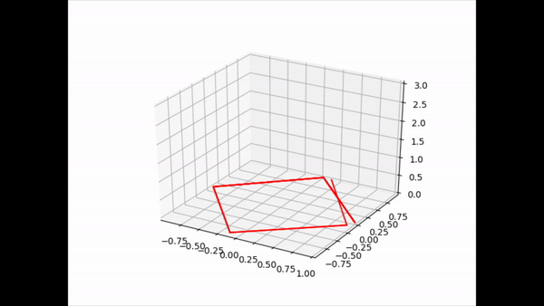
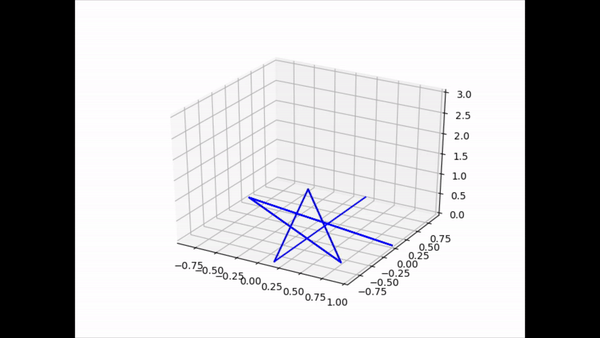
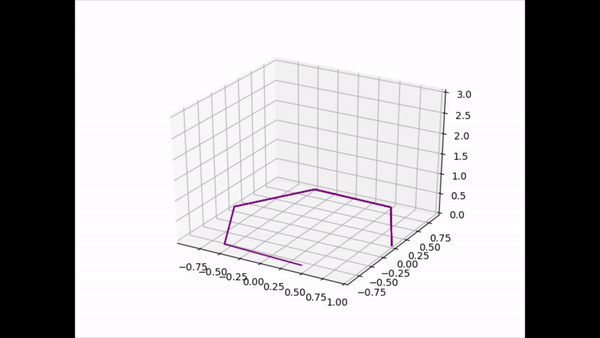
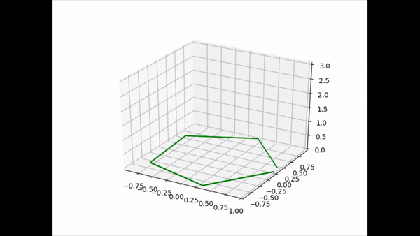
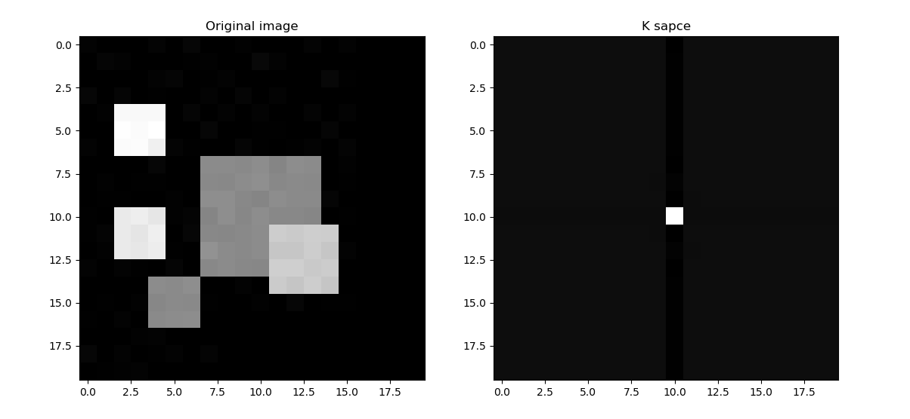
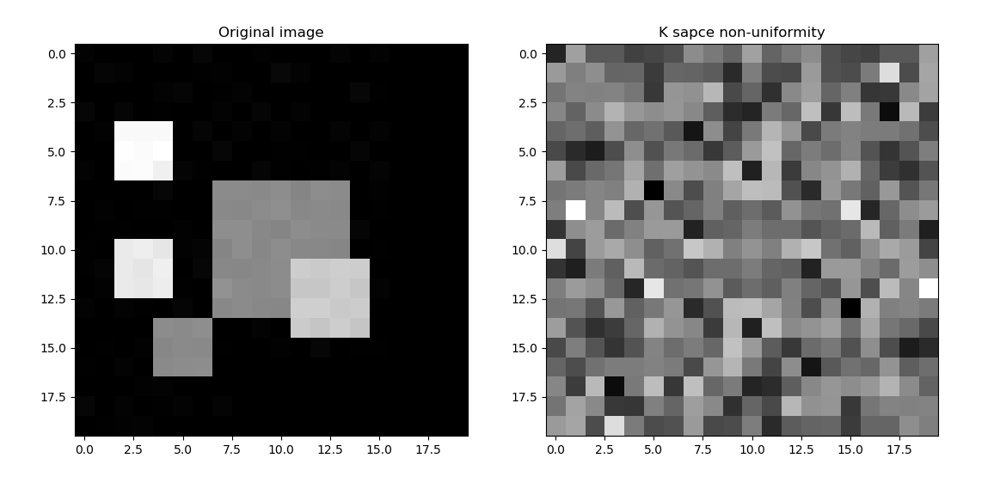

# **Assignment 3**

                                    Team Members 
                    
                    Asmaa Mahmoud               SEC: 1 BN: 14
                    
                    Donia Abd El-Salam          SEC: 1 BN: 29
                    
                    Salma Hamza                 SEC: 1 BN: 38
                    
                    Mariam Ahmed                SEC: 2 BN: 29

---

## **Draw the trajactory at any point**
 
Firstly, we get T1 and T2 values at every pixel in our image based on the pixel's density by using the function *getT1AndT2()* and the *mapping()* function is used to map between the range of T1 and T2 of certain material and the material color degree.

```
    def getT1AndT2():
        dim = fileName.shape[0]
        T1 = np.empty((dim,dim))
        T2 = np.empty((dim,dim))
        rho = np.empty((dim,dim))

        for row in range (dim):
            for col in range (dim):
                if (np.mean(data[row][col]) == 0):
                    T1[row][col] = 1.09
                    T2[row][col] = 0.61 
                    rho[row][col] = 85              
                elif(np.mean(data[row][col])==255):
                    T1[row][col] = 0.76
                    T2[row][col] = 0.61
                    rho[row][col] = 70            
                else:
                    T1[row][col],T2[row][col] = mapping(np.mean(data[row][col]))
                    rho[row][col] = 85    
        return(T1,T2,rho)


    def mapping(value):
        T1Range =(0.8,2)
        T2Range =(0.11,2)
        val1 = ((value -T1Range[0])/(T1Range[1]-T1Range[0]))*T1Range[0]
        val2 = ((value -T2Range[0])/(T2Range[1]-T2Range[0]))*T2Range[0]    
        return(val1,val2)
```
Then we select certain pixel and plot the trajactory at this point we only change the values of x *row* and y *Col* then **Point() function** gets T1, T2 and the density at this pixel  then  calls the blochEquation to start calculating the Mx, My and Mz at this point. 

```

def point():
    T1,T2,rho = getT1AndT2()
    T1 = T1[x][y]*1000
    T2 = T2[x][y]*1000
    Gx = ((2*np.pi)/dim)*x
    Gy = (-np.pi) + (((2*np.pi)/dim)*y)
    df =42.4*(3 + x*Gx + y*Gy)
    blochEquation(T1,T2,df)

def blochEquation(T1,T2,df):
    dT =1    
    A,B = freeprecess(dT,T1,T2,df)
    xdata,ydata,zdata = Magnetization(A,B)
    plot(xdata,ydata)

def freeprecess(dT ,T1 ,T2 , df):
    phi = df
    E1 = np.exp(-dT/T1) 
    E2 = np.exp(-dT/T2) 
    Afp = np.dot([[E2,0,0],[0,E2,0],[0,0,E1]],zrot(phi))     
    Bfp = [0 ,0 ,1-E1]   
    return(Afp,Bfp)

def zrot(phi):   
    Rz = [[np.cos(phi) ,-np.sin(phi), 0],[np.sin(phi) ,np.cos(phi), 0],[ 0, 0 ,1]]
    return(Rz)

def Magnetization(A,B):
    M = np.empty((N,3))    
    M[0,:] =np.array([1,0,0])   
    for k in range (N-1):
        M[k+1,:] = np.dot(A,M[k,:])+B
    return(M[:,0],M[:,1],M[:,2])


def plot(xdata,ydata):
   
    ax = pylab.gca(projection='3d')   
    ax.set_xlim(min(xdata), max(xdata))
    ax.set_ylim(min(ydata),max(ydata))
    ax.set_zlim(0, 5)
    for i in range(1,500):
        dataxPlot.append(xdata[i-1])
        datayPlot.append(ydata[i-1]) 
        pylab.plot(dataxPlot,datayPlot,z[:i],color ="red",linewidth=1.5)
        pylab.draw()
        pylab.pause(1e-117)        
     
    plt.show() 
```

*Results*
----
The output trajectory at  pixel (0,0)




The output trajectory at  pixel (1,2)




The output trajectory at  pixel (4,0)




The output trajectory at  pixel (3,3)




--------------------
## Generate the K-space of the image 

By iterating over the rows and columns of the kspace array which, we initialized with zeros, at every element in the kspace array we calculate the signal at this element as the summation of spins and iterate allover the image pixels one by one generating the gradients Gx and Gy and adding them to theta where, *theta = summation(df(Gx + Gy + 3pi/180)*. So, we substitue in the equation *element = signalxcos(theta) +jsin(theta)*. After getting the kspace element we take the inverse fourier to plot the kspace image.


```
def k_space():
    T1,T2,rho = getT1AndT2()
 
    for row in range(dim):
        for col in range(dim):
            spin = (rho[row][col])*(1-np.exp(-TR/T1[row][col]))*(np.exp(-TE/T2[row][col]))
            spins.append(spin)
            for n in range(dim):
                Gy = (-np.pi) + (((2*np.pi)/dim)*n)
                for i in range(dim):
                    Gx = 0 + (((2*np.pi)/dim)*i)
                    theta.append(df*(Gx + Gy +3*np.pi/180) )
            signal = np.sum(spins)
            kspace[row][col] =signal*np.cos(np.sum(theta)) + 1j*np.sin(np.sum(theta))
    image = fft.ifftn(kspace)
    image = fft.fftshift(image)
    k = np.real(image)    
    plt.imshow(k, cmap = 'gray',interpolation='nearest')
    plt.title('K sapce
```
*Results*


----------------------------
## Generate The K-space with non-uniformity function

Fistly we generate random B by the function **RandomB()**
```

def RandomNumbers():
    seed(1)
    for j in range(0,dim):
        for i in range(0,dim):
            for n in range(0,dim):
                for k in range(0,dim):
                    RN[j][i][n][k] =random()*0.5 +3
    return(RN)


```

Then we use the same function of uniform B except changing the value of B at any point. 

```
def NonUniformKspace():
    T1,T2,rho = getT1AndT2()
    RN = RandomNumbers()
    for row in range(dim):
        for col in range(dim):
            spin = (rho[row][col])*(1-np.exp(-TR/T1[row][col]))*(np.exp(-TE/T2[row][col]))
            spins.append(spin)
            for n in range(dim):
                Gy = (-np.pi) + (((2*np.pi)/dim)*n)
                for i in range(dim):
                    Gx = 0 + (((2*np.pi)/dim)*i)
                    theta.append(df*(Gx + Gy + (RN[row][col][n][i]*np.pi)/180))
            signal = np.sum(spins)
            kspace[row][col] =signal*np.cos(np.sum(theta)) + 1j*np.sin(np.sum(theta))
    image = fft.ifftn(kspace)
    image = fft.fftshift(image)
    k = np.real(image)    
    plt.imshow(k, cmap = 'gray',interpolation='nearest')
    plt.title('K sapce with non-uniformity')
    plt.show() 

```
*Results*




